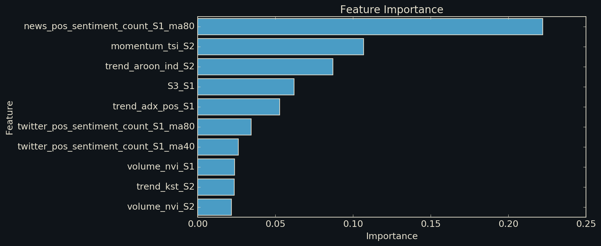
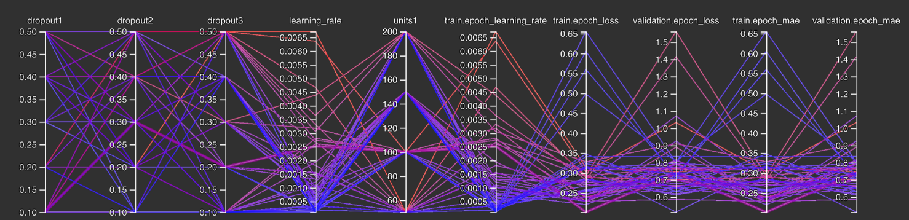
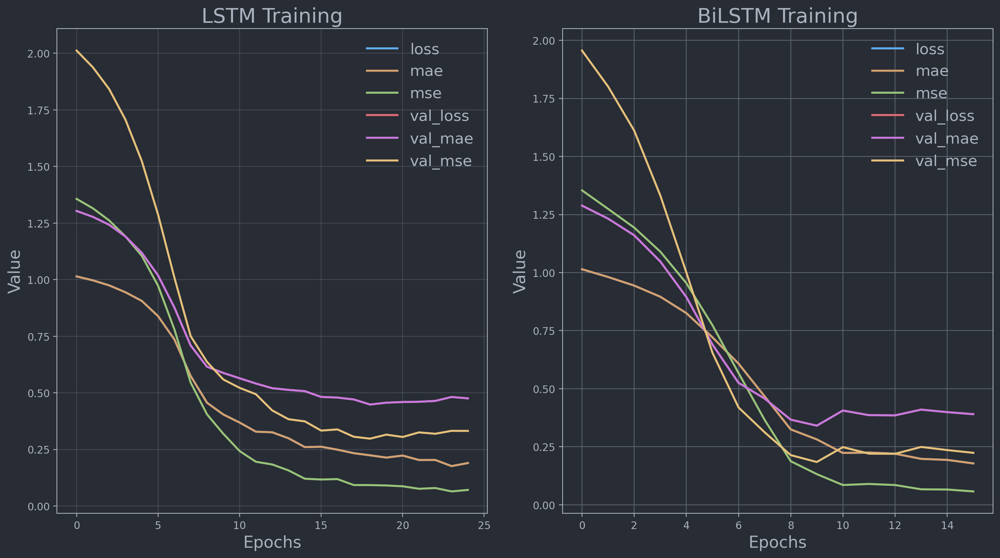
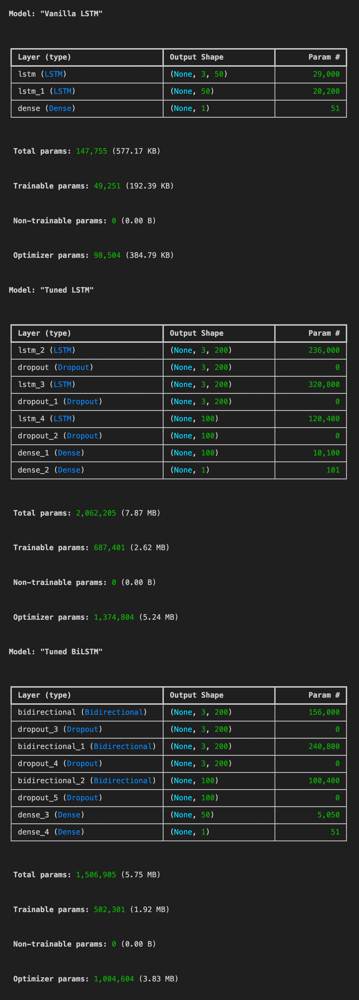
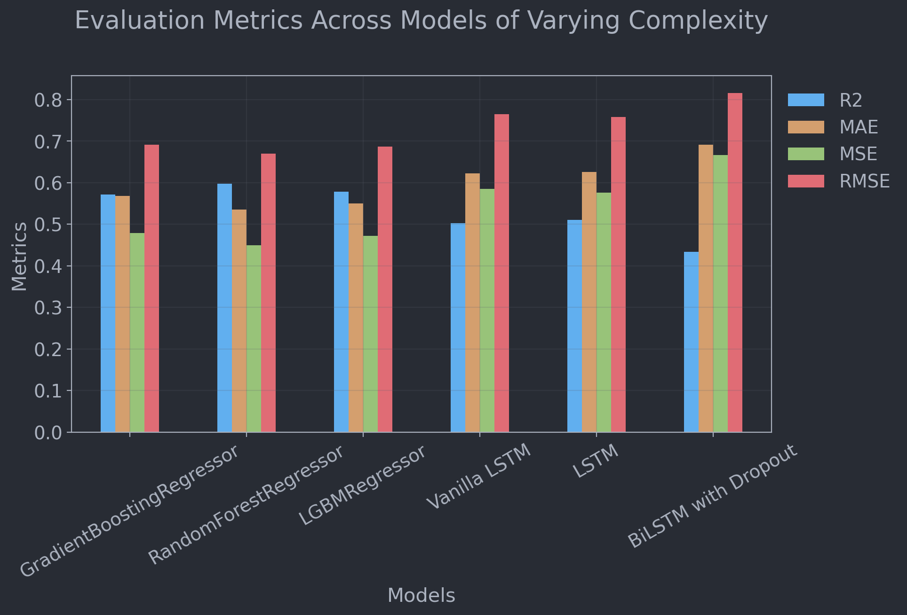

# Assessing the Impact of ML Model Architecture Complexity on Pairs Trading Optimization

<div align="center">
<h3>Authors</h3>
<table>
  <tr>
    <td>Darien Nouri</td>
    <td><a href="mailto:dan9232@nyu.edu">dan9232@nyu.edu</a></td>
  </tr>
  <tr>
    <td>Charles Wang</td>
    <td><a href="mailto:mw4899@nyu.edu">mw4899@nyu.edu</a></td>
  </tr>
  <tr>
    <td>Yihao Zhong</td>
    <td><a href="mailto:yz7654@nyu.edu">yz7654@nyu.edu</a></td>
  </tr>
</table>
</div>


## Introduction

This project investigates the relationship between machine learning model complexity and the effectiveness of pairs trading strategies. Pairs trading is a mean-reversion strategy that seeks to profit from the relative price movements of two correlated securities. The core idea is to identify pairs of securities that historically move together, then take long and short positions when their prices diverge, anticipating a return to their historical relationship. We explore how increasing model sophistication affects performance in predicting the spread between stock pairs.

To put simply, this study aims to see if all this extra complexity actually pays off when it comes to predicting stock movements and making trading decisions. We're trying to find that sweet spot between a model that's smart enough to catch subtle patterns, but not so complicated that it starts seeing patterns that aren't really there. 

Additionally, we aim to shed light on the potential trade-offs, both benefits and drawbacks, that might be associated with higher or lower model complexity in the context of financial forecasting.

<p style="font-size:14px">
<b>Note:</b> <i>Actually implementing a viable pairs trading strategy is not the main focus of this project. The main focus is to evaluate performance as a function of varying model complexity in forecasting the spread between two stocks. The pairs trading strategy is just a simple example of how the forecasted spread can be used in practice. I hope no one tries to trade with the models in this project. That would be a bad idea. You will regret it. Build your own model. You have been warned.</i>
<br>
<i>If someone from bloomberg is reading this, all analyses with respect to bloomberg data were performed on NYU terminals/HPC instances and not on personal machines. *cough. cough*</i>
</p>


## Procedure

Our approach involves:

1. **Stock Pair Selection**: We developed a systematic approach to identify stock pairs from the S&P universe based on correlation and cointegration criteria.
2. **Data Collection and Preprocessing**: We gathered extensive data from various sources, including technical indicators and sentiment data from Refinitiv, financial news headlines, and Twitter.
3. **Feature Engineering**: Derived a 280 feature set for each stock and their spread, incorporating technical indicators as well as sentiment analysis to capture potential market shifts not yet reflected in price data.
4. **Model Development**: Implemented and compared various models in forecasting spread, including:

   - Traditional regression models (Linear Regression, Gradient Boosting, Random Forest, LightGBM)
   - Deep learning models (Vanilla LSTM, Hyperparameter-tuned LSTM, BiLSTM)
5. **Hyperparameter Tuning**: Implementation of Keras Tuner to optimize model architectures and hyperparameters.
6. **Model Evaluation**: Models were trained and evaluated using standard metrics such as MSE, MAE, and R2.
7. **Backtesting**: Implemented a simple mean reversion strategy to backtest the models' performance in a simulated trading environment.
8. **Performance Analysis**: Compared model performance across various metrics, including annualized returns, Sharpe ratio, and max drawdown.


## Stock Pair Selection

We developed a systematic approach to identify stock pairs from the S&P, focusing on statistical relationships rather than potential profitability. This method ensured consistency across all models and experiments while controlling for selection bias.
Our selection criteria balanced long-term equilibrium with enough price divergence to trade on:

- Cointegration: Minimized p-value to indicate stronger long-term equilibrium.
- Correlation: Maximized up to 0.8 threshold, ensuring similar movement but allowing trading opportunities.

We chose the S&P universe to ensure stocks likely to have meaningful news coverage. The top 10 ranked pairs based on our criteria are:

| agg_rank | ticker_0 | ticker_1 | corr   | cointeg_pval |
| -------- | -------- | -------- | ------ | ------------ |
| 0        | GS       | BLK      | 0.8344 | 0.016        |
| 1        | JPM      | CRM      | 0.839  | 0.0265       |
| ...      |          |          |        |              |
| 9        | HON      | C        | 0.7518 | 0.2875       |
| 10       | C        | BLK      | 0.7826 | 0.3438       |


### Feature Engineering and Importance

We developed our feature set with the goal of capturing bespoke patterns and influences that could potentially influence the spread between the stock pairs.

The 280 features can be categorized as follows:

1. [Historical Pricing data](miscellaneous/data_preprocessing/save_price_hist_indicators_tofile.ipynb) (e.g., price, volume, volatility)
2. [Derived Technical-Indicators](data_utils/technical_indicators.py) (e.g., moving averages, oscillators, volatility measures) 
3. [Stock sentiment indicators](sentiment_analysis/NexiSentiment.ipynb)
4. Spread-derived pricing and sentiment features between pairs

5. Temporal features capturing seasonal and cyclical patterns




> *Pretty cool to note how one of the sentiment features, particularly the 60-day moving average of positive news mentions, contributed the most to the model.*


- Relevant Code: 
  - [Feature set construction](miscellaneous/data_preprocessing/join_technicals_with_sentiments.ipynb)
  - [technical_indicators.py](data_utils/technical_indicators.py)
  - [analysis_setup.ipynb](models/supporting/analysis_setup.ipynb)

## Model Training and Evaluation


Relevant code: [analysis_lstm_hypertuned_all_forecasts.ipynb](models/analysis_lstm_hypertuned_all_forecasts.ipynb).

### Regression Models

Established a baseline using traditional regression models:

- Linear Regression
- Gradient Boosting Regression
- Random Forest Regression
- LightGBM Regression

### Deep Learning Models

- Vanilla LSTM: Two LSTM layers (50 units each) with a dense output layer
- Hyperparameter-tuned LSTM: Optimized using Keras Tuner
- BiLSTM with Dropout

### Hyperparameter Tuning

Used [KerasTuner with RandomSearch](https://www.tensorflow.org/tutorials/keras/keras_tuner)

- Number of LSTM layers (1-3)
- Units per layer (50-200)
- Dropout rates (0.1-0.5)
- Dense layers (1-2)
- Learning rate [1e-2, 1e-3, 1e-4]

The tuning process ran for 100 trials, with early stopping after 4 epochs without improvement to prevent overshoot.



### Model Complexity

The Vanilla LSTM had 49,251 parameters, while the tuned LSTM model reached up to 2,062,205 parameters.

### Evaluation

Models were trained and evaluated using MSE, MAE, and R2 metrics. Training curves and architecture visualizations were generated to compare model performance.





This approach allowed us to investigate the relationship between model complexity and forecasting performance in the context of pairs trading.

### Model Performance

We evaluated various models in forecasting the spread between the selected stock pairs. The table below summarizes their performance:


Key observations:

1. **Metric Discrepancy**: Simpler models performed better in terms of MSE. This could be due to the non-stationarity between our training data (2021-2022, moderate market performance) and test set (2023-2024, significant bull run with 30% S&P gains).
2. **Non-Stationarity Handling**: To address this issue during backtesting, we incorporated a Bayesian approach to adjust the predicted z-score spread distribution daily based on priors. This allowed models to adapt to shifts in the spread distribution, providing more accurate predictions in the non-stationary environment. However, this is just one approach, a pre-processing method may be more effective.
3. **Complexity vs. Performance**: Despite lower MSE scores, more complex models like LSTM and BiLSTM showed better performance in the backtesting phase, suggesting they captured nuanced patterns beneficial for trading decisions. 
   - It may be benefical to implement custom optimization or loss function tailored to the trading objective could further improve performance in future works.


>**Note:** Traditional evaluation metrics like MSE may not accurately reflect a model's trading performance, as signals are generated based on directional changes rather than prolonged, consistent errors.




## Backtesting

### Methodology

For backtesting the trained models, we implemented a simple mean reversion strategy here [backtester.ipynb](backtesting/backtester.ipynb).

1. **Calculate Trading Signals**: The trading signals (long or short) are based on the predicted z-scored spread, previously calculated [here](models/analysis_lstm_hypertuned_all_forecasts.ipynb), and a predefined threshold. If the predicted z-scored spread was below the threshold, we generated a long signal, and if it was above, we generated a short signal.
2. **Backtest Strategy Execution**: We implemented a mean reversion strategy based on the generated trading signals. The strategy involved taking long or short positions in the stock pairs when the predicted spread deviated from its historical relationship (as determined by the z-scored spread threshold). The strategy was executed using a BayesianRidge model to dynamically update the hedge ratio between the two stocks in the pair. 
3. **Aggregate Results**: To facilitate greater statistical confidence, we aggregated the backtesting results across all stock pairs grouped by model.

The backtesting process was performed with an initial capital of $\$100,000$ and a 1% transaction cost on each trade.

### Results

The table below summarizes the backtesting results for the various models across the selected stock pairs:

| Model                     | Trading days | Final Portfolio Value | Annualized Returns | Sharpe Ratio | Sortino Ratio | Max Drawdown | Average Return | Standard Deviation |   CAGR |      R2 |    MAE |    MSE |   RMSE |
| ------------------------- | ------------ | --------------------: | -----------------: | -----------: | ------------: | -----------: | -------------: | -----------------: | -----: | ------: | -----: | -----: | -----: |
| GradientBoostingRegressor | 587          |           $180,549.02 |             44.40% |       2.6620 |        3.8357 |      -34.95% |          0.15% |              1.10% | 44.33% |  0.6582 | 0.5729 | 0.5203 | 0.7213 |
| RandomForestRegressor     | 587          |           $150,277.44 |             28.82% |       1.8627 |        2.5793 |      -40.26% |          0.11% |              1.10% | 28.75% |  0.6885 | 0.5479 | 0.4743 | 0.6887 |
| LGBMRegressor             | 587          |           $153,462.12 |             30.51% |       1.8692 |        2.6689 |      -40.01% |          0.11% |              1.15% | 30.45% |  0.6634 | 0.5547 | 0.5124 | 0.7158 |
| Vanilla LSTM              | 489          |           $118,982.87 |             13.85% |       0.6610 |        0.4621 |      -81.16% |          0.08% |              2.22% | 13.85% | -0.1247 | 1.1471 | 1.7872 | 1.3369 |
| LSTM                      | 489          |           $221,007.24 |             80.75% |       4.1318 |        7.4471 |      -20.96% |          0.24% |              1.12% | 80.72% |  0.4565 | 0.8177 | 0.8636 | 0.9293 |
| BiLSTM with Dropout       | 489          |           $203,613.07 |             70.02% |       3.3429 |        4.3380 |      -24.15% |          0.22% |              1.25% | 69.99% |  0.4087 | 0.8358 | 0.9396 | 0.9694 |

### Analysis and Insights

1. **Model Complexity and Performance**: Overall we can see a clear trend with performance as a function of model complexity. The more complex models, such as LSTM and BiLSTM with Dropout, generally outperformed the simpler models (e.g., RandomForestRegressor, GradientBoostingRegressor) in terms of higher returns and better risk-adjusted performance. This suggests that the increased model complexity was able to capture bespoke relationships and patterns in the data more effectively.
2. **Feature Engineering**: The incorporation of our complex feature set, particularly the sentiment features, contributed significantly to the model's performance. For the most part, these features are non-linear and complex, such that many of them provide little to no information to simpler models. However, LSTMs, with their recurrent structure and gating mechanisms, can effectively leverage complex and non-linear features like sentiment by accounting for rare or bespoke combinations of activations (e.g., a rare combination of positive news mentions from three days ago and high trading volume).
3. **Benchmark Comparison**: When compared to SPX over the same period, three out of the five trained models (GBR, LSTM, and BiLSTM with Dropout) outperformed the market in terms of annualized returns.

<hr>

## Future Work

### Model Architecture and Techniques

1. **Time Series Transformers**: Explore specialized transformers for financial time series data such as the one found [here](https://huggingface.co/docs/transformers/en/model_doc/time_series_transformer).
2. **Alternative Architectures**: Investigate TCNs, hybrid models, and Graph Neural Networks.
3. **Ensemble Methods**: Combine predictions from multiple models of varying complexity.
4. **Reinforcement Learning**: Implement for dynamic portfolio optimization.
5. **Activation Analysis**: Investigate activation patterns within complex models to identify influential feature combinations for spread forecasting.


### Model Optimization and Robustness

5. **Custom Optimization or Loss Functions**: Develop custom optimization or loss functions tailored to the specific trading objective to further improve performance.
6. **Deeper Hyperparameter Search**: Conduct more extensive tuning using advanced techniques like Bayesian optimization.
7. **Robustness to Unexpected Events**: Stress test models under simulated extreme market conditions.
8. **Extended Market Conditions**: Analyze performance across various market cycles.

### Data Integration and Feature Engineering

8. **Fundamental Data Integration**: Explore the potential of incorporating fundamental data, such as financial statements, earnings reports, and economic indicators.
9. **Street Expectations**: Incorporate analyst forecasts and market expectations into the model inputs.
10. **Sector and Name-Focused KPIs**: Integrate industry-specific and company-specific key performance indicators to enhance prediction accuracy.


<br>

<hr>


### Directory Structure

Key Notebooks:
- [`LSTM Tuning and Batch Runner`](models/analysis_lstm_hypertuned_all_forecasts.ipynb): Notebook for hyperparameter tuning of LSTM models and evaluating performance across all pairs.
- [`Backtester`](backtesting/backtester.ipynb): Implementation of backtesting strategy.
- [`Feature Construction`](miscellaneous/data_preprocessing/join_technicals_with_sentiments.ipynb): Feature set construction/dataset merging.
- [`Price Data Processing`](miscellaneous/data_preprocessing/save_price_hist_indicators_tofile.ipynb): Historical pricing data processing.
- [`Sentiment Analysis`](sentiment_analysis/NexiSentiment.ipynb): Bert transformer based sentiment analysis processing.
- [`News Headline Scraper`](sentiment_analysis/async_news_scraper.py): Asynchronous news headline scraper from Nexis Database.

Project Structure:
```
.
├── backtesting                          # Scripts for backtesting trained models
├── data                                 # Various datasets used in the project
│   ├── nexis_news_data_cleaned          # Cleaned news data from Nexis
│   ├── price_history                    # Historical price data for stocks
│   ├── sentiments                       # Sentiment data for stocks
│   └── technical_indicators             # Technical indicators for stocks
├── data_utils                           # Utility library for Refinitiv data
├── docs                                 # Supporting publications
├── figures                              # Visualizations and graphs
├── miscellaneous                        # Utility scripts and preprocessing tools
├── models                               # Training and evaluation notebooks
│   ├── archive                          # Archived model files
│   ├── logs                             # Model training logs
│   └── supporting                       # Supporting scripts and notebooks
└── sentiment_analysis                   # Sentiment analysis and news scraping

```
<br>

> **Note:** This project is for academic research. Do not use for commercial purposes, including Bloomberg or Refinitiv data.

<hr>

### References

[1]: [Nouri, D., Wang, C., &amp; Zhong, Y. (2024). *ML Model Complexity and U.S. Securities Strategy*. New York University.](https://general-scratch.s3.amazonaws.com/ML_Model_Complexity_and_US_Securities_Strategy.pdf)

[2]: [Staffini, A. (2022). Stock price forecasting using generative adversarial networks. Fuzzy AI Applications in Finance, 8, 837596. Frontiers](https://general-scratch.s3.amazonaws.com/Fuzzy_AI_Applications_in_Finance.pdf)

[3]: [Otabek, S., &amp; Choi, J. (2024). Multi-level deep Q-networks for Bitcoin Trading Strategies. Scientific Reports, 14(1). DOI:10.1038/s41598-024-51408-w](https://general-scratch.s3.amazonaws.com/Innovative_Methods_in_Financial_Analysis.pdf)

[4]: [Bakhach, A., Rostamian, A., &amp; O’Hara, J. G. (2022). CNN-LSTM Based Framework for Trading Signal Generation Using Tick Bars/Candlesticks. Neural Computing and Applications, 34, 17193--17205. Springer](https://general-scratch.s3.amazonaws.com/Hybrid_Approaches_for_Stock_Price_Prediction.pdf)

[5]: [Yan, X., Qian, J. H., Ma, J., Zhang, A., Lennon, S. E., Bu, M.-P., Lin, K. J., Liu, X., Wang, H., Sangwan, V. K., &amp; others. (2023). Reconfigurable heterojunction transistors for in-sensor support vector machine classification. Nature Electronics, 6(10), 777--785. Nature Publishing Group](https://general-scratch.s3.amazonaws.com/Reconfigurable_Heterojunction_Transistors_for_SVM_Classification.pdf)

[6]: [Shah, J., Vaidya, D., &amp; Shah, M. (2022). A comprehensive review on multiple hybrid deep learning approaches for stock prediction. Intelligent Systems with Applications, 16, 200111. Elsevier](https://general-scratch.s3.amazonaws.com/Financial_Prediction_Using_Machine_Learning.pdf)

[7]: [Xu, Z., &amp; Luo, C. (2023). Adaptive learning for pairs trading with double deep Q-network and temporal difference learning. Engineering Applications of Artificial Intelligence, 126, 107148. Elsevier](https://general-scratch.s3.amazonaws.com/Adaptive_Learning_in_Algorithmic_Trading.pdf)

[8]: [Lee, S., &amp; So, W.-S. (2020). Multimodal reinforcement learning for stock trading using image and time series data. In 2020 International Conference on Information and Communication Technology Convergence (ICTC) (pp. 1575--1577). IEEE](https://general-scratch.s3.amazonaws.com/Multimodal_Reinforcement_Learning_Stock_Trading.pdf)

[9]: [Kumar, H., Agarwal, P., &amp; Rani, M. (2020). Comparative Study of LSTM and DNN for Daily Stock Forecasting. In 2020 International Conference on Electronics and Sustainable Communication Systems (ICESC) (pp. 1080--1085). IEEE](https://general-scratch.s3.amazonaws.com/Comparative_Study_LSTM_DNN_Stock_Forecasting.pdf)