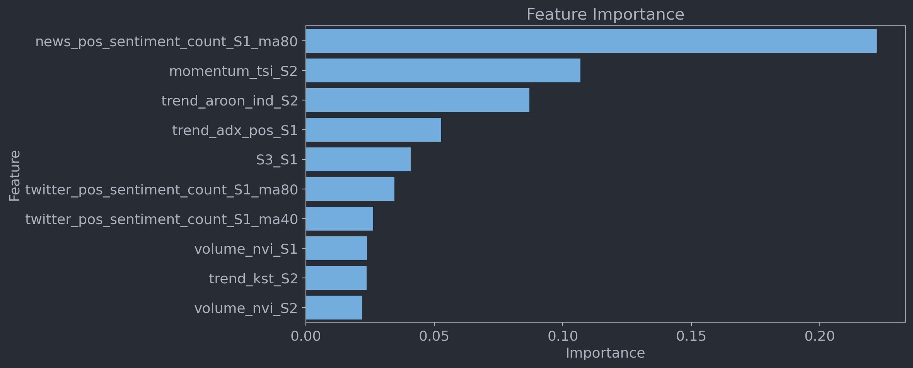
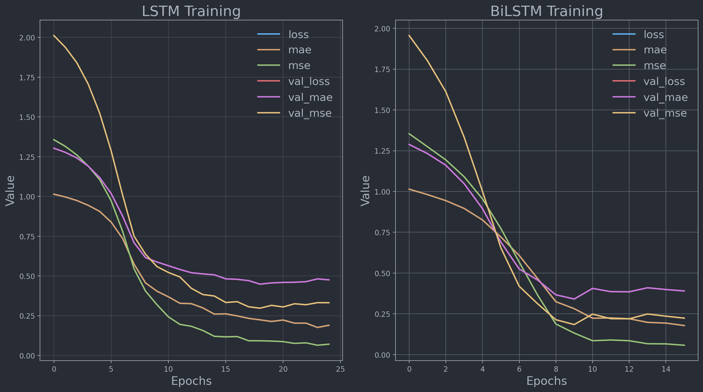
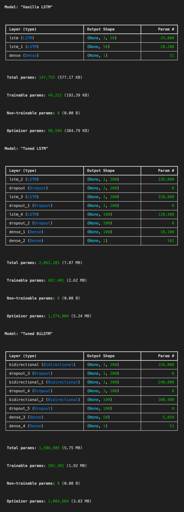
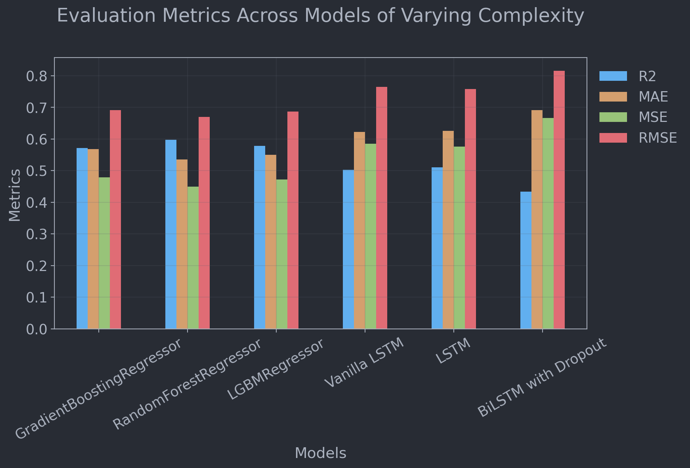

# ML Model Complexity and U.S. Securities Strategy

Charles Wang: mw4899@nyu.edu
Darien Nouri: dan9232@nyu.edu
Yihao Zhong: yz7654@nyu.edu

### Introduction

Implementation of a simple Pairs Trading Strategy over Forecasted Spreads using models of varying complexity from Regressors to Transformers.

Models are trained, evaluated then backtested. The project also involves extensive data collection, cleaning, and preprocessing of technical indicators and sentiment data from various sources, including Bloomberg, Refinitiv and News headline Scraping, for which many did not make into the final analysis as better alternatives were found.

**Note:** *Actually implementing a viable pairs trading strategy is not the main focus of this project. The main focus is to evaluate performance as a function of varying model complexity in forecasting the spread between two stocks. The pairs trading strategy is just a simple example of how the forecasted spread can be used in practice. I hope no one tries to trade with the models in this project. That would be a bad idea. You will regret it. Build your own model. You have been warned.*

*If someone from bloomberg is reading this, all analyses with respect to bloomberg data were performed on NYU terminals/HPC instances and not on personal machines. cough. cough\***

### Stock Pair Selection

We selected stock pairs based on their correlation and cointegration from the universe of S&P 500 stocks. Settled with S&P based stocks since we require the companies to have enough news mentions for representative features of actual sentiment. Below are top 10 ranked pairs based on our criteria:

1. Minimize coinegration p-value
2. Maximize correlation below a threshold of 0.8 since we need some spread to trade.

| agg_rank | ticker_0 | ticker_1 | corr   | cointeg_pval |
|----------|----------|----------|--------|--------------|
| 0        | GS       | BLK      | 0.8344 | 0.016        |
| 1        | JPM      | CRM      | 0.839  | 0.0265       |
| 2        | INTC     | C        | 0.8583 | 0.1598       |
| 3        | WFC      | UNP      | 0.7002 | 0.0293       |
| 4        | HON      | GS       | 0.6692 | 0.0188       |
| 5        | HON      | BLK      | 0.8017 | 0.2085       |
| 6        | JPM      | GS       | 0.7291 | 0.1579       |
| 7        | WFC      | AXP      | 0.7783 | 0.2241       |
| 8        | WFC      | GS       | 0.7102 | 0.1923       |
| 9        | HON      | C        | 0.7518 | 0.2875       |
| 10       | C        | BLK      | 0.7826 | 0.3438       |
 

### Feature Engineering and Importance
We then derived over 200 technical indicators for each stock as well as their spread. Below is a figure of the top 10 features ranked by their importance in predicting the spread. 

Pretty cool to note how one of the sentiment features, particularly the 60-day moving average of positive news mentions, contributed the most to the model.

### Model Training and Evaluation

We trained and evaluated various parametric and non-parametric models on the derived features. Below shows the training curves of LSTM and BiLSTM models with hyperparameter tuning using HyperBand.

Hyperparameter tuning was done using HyperBand with a maximum budget of 100 epochs and a maximum budget of 10 epochs per configuration. Below is a fairly dope visualization of the HyperBand tuning process I pulled from the TensorBoard logs.

Below are the architectures of the LSTM and BiLSTM models used in the project. The Vanilla LSTM model consists of two LSTM layers with 64 units each. The LSTM and Bi-LISTM model parameters were tuned using HyperBand with a maximum budget of 100 epochs and a maximum budget of 10 epochs per configuration. 

**Note on Complexities:** The title "vanilla" is given to the basic LSTM model with respect to the number of trainable parameters, the "tuned" LSTM model has nealy 15x the number of trainable parameters as the Vanilla LSTM model, from $147,755$ to $2,062,205$. 

### Model Performance

The table below summarizes the performance of various models in forecasting the spread between the selected stock pairs. You'll notice that the simpler model performed better. After digging into this it is becuase our training set ranges from 2021-2022, a time with moderate market performance, and our test test covers 2023-2024 which has seen a massive bull run with 30% s&p gains. At the end of the day we are trying to predict the z-scored spread between the pair, this assumes a mean of 0 and std of 1. 

The table below summarizes the performance of various models in forecasting the spread between the selected stock pairs. You'll notice that the simpler models performed better. After digging into this, it is because our training set ranges from 2021-2022, a time with moderate market performance, and our test set covers 2023-2024, which has seen a massive bull run with 30% S&P gains. At the end of the day, we are trying to predict the z-scored spread between the pair, which assumes a mean of 0 and a standard deviation of 1.

Due to the non-stationarity of the true spread caused by the bull run period in the test dataset, models that were more off in the negative direction performed better since they simply longed everything. This highlights the fundamental issue with building this strategy with the frequentist framework in mind, which did not generalize well given an underlying change in the test distribution.

To address this, we altered the strategy to follow a Bayesian approach in which we adjust the distribution of the predicted z-score spread during each trading day based on the priors. By incorporating the prior information about the changing market conditions, the Bayesian models were able to adapt to the shifts in the spread distribution and provide more accurate predictions. This approach allowed the models to dynamically update their beliefs about the spread based on the observed data, resulting in improved performance and robustness to non-stationary environments.

### Backtesting

Overall we can see a clear trend with performance as a function of model complexity. The more complex models, such as LSTM and BiLSTM with dropout, were able to capture the dynamics of the spread more effectively, resulting in higher returns and better risk-adjusted performance. A possible explanation for this relies partly on our feature set that includes over 200 TIs and sentiment features. For the most part, these features are non-linear and complex, such that many of them provide little to no information to simpler models.  

The simpler models, while still profitable, had lower returns and higher drawdowns, indicating that they may not be as effective in capturing the complex relationships between the pairs. 

Since the models are tested during a bull run, with the S&P seeing over 30% gains, large returns are not impressive with benchmarks in place. With respect to the S&P over this time period, three of the five trained models were able to outperform the market.

All backtests were performed with a starting capital of $$100,000$ and a leverage of 1. The table below summarizes the backtesting results of the various models.

| Model                     | Number of days | Final Portfolio Value | Annualized Returns | Sharpe Ratio | Sortino Ratio | Max Drawdown | Average Return | Standard Deviation | CAGR        | r2              | mae              | mse              | rmse             |
|---------------------------|----------------|----------------------:|-------------------:|-------------:|--------------:|-------------:|---------------:|-------------------:|------------:|----------------:|----------------:|----------------:|----------------:|
| GradientBoostingRegressor | 587            |            $180,549.02 |             44.40% |       2.6620 |        3.8357 |      -34.95% |         0.15% |             1.10% |     44.33% |          0.6582 |          0.5729 |          0.5203 |          0.7213 |
| RandomForestRegressor     | 587            |            $150,277.44 |             28.82% |       1.8627 |        2.5793 |      -40.26% |         0.11% |             1.10% |     28.75% |          0.6885 |          0.5479 |          0.4743 |          0.6887 |
| LGBMRegressor             | 587            |            $153,462.12 |             30.51% |       1.8692 |        2.6689 |      -40.01% |         0.11% |             1.15% |     30.45% |          0.6634 |          0.5547 |          0.5124 |          0.7158 |
| Vanilla LSTM              | 489            |            $118,982.87 |             13.85% |       0.6610 |        0.4621 |      -81.16% |         0.08% |             2.22% |     13.85% |         -0.1247 |          1.1471 |          1.7872 |          1.3369 |
| LSTM                      | 489            |            $221,007.24 |             80.75% |       4.1318 |        7.4471 |      -20.96% |         0.24% |             1.12% |     80.72% |          0.4565 |          0.8177 |          0.8636 |          0.9293 |
| BiLSTM with Dropout       | 489            |            $203,613.07 |             70.02% |       3.3429 |        4.3380 |      -24.15% |         0.22% |             1.25% |     69.99% |          0.4087 |          0.8358 |          0.9396 |          0.9694 |

**Final note on these results:** Due to sentiment data constraints, the models were only tested on the 2023-2024 bull market. As a result, their performance may not generalize well to other market conditions.

 
 
 

### Directory Structure

- `models/`: Contains notebooks for training and evaluating various deep learning models.
- `strategies/backtesting/`: Contains scripts for backtesting the trained models.
- `technical-indicator-datalib/`: Contains scripts for collecting and updating market data and derived technical indicators.
- `utils/`: Contains utility scripts for data downloading and visualization.
- `sentiments/`: Contains scripts and data related to sentiment analysis as well as news scraping.
- `data/`: Contains various datasets used in the project.

**Note:** The files and data in this project were created and collected as part of an academic research project and should not be downloaded or used for commercial purposes. This includes any Bloomberg or Refinitiv data that may be present in the project.